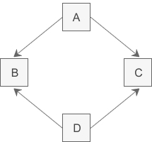
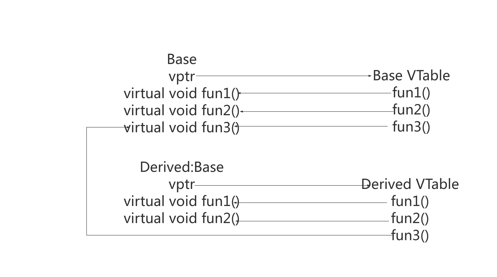
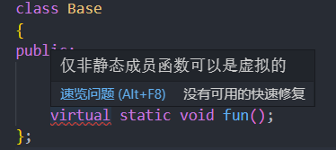
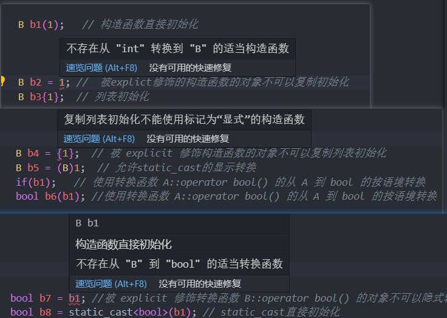
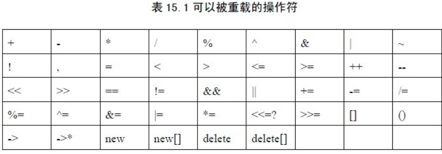

# 基础进阶

# const

## 作用

const为类型说明符，可以用来

* 定义常量；  const int a=10;  

  * 常量表达式：值不会改变 并且在<u>编译过程就能得到计算结果</u>的表达式。字面量（不能改变的值）属于常量表达式，用常量表达式初始化的const对象也是常量表达式。

* 类型检查； 

  ```c++
  注意区分 const常量和#define。
  const常量具有类型安全检查功能，#define仅仅是字符串替换
  const 定义的变量只有类型为整数或枚举，且以常量表达式初始化时才能作为常量表达式。
  其他情况下它只是一个 const 限定的变量，不要将其与常量混淆。
  ```

* 防止修改，起到变量保护的作用；

* 节省空间，避免不必要的内存分配。 

  * const定义常量从汇编的角度来看，只是给出了对应的内存地址，而不是像#define一样给出的是立即数，所以，const定义的常量在程序运行过程中只有一份拷贝，而#define定义的常量在内存中有若干个拷贝

## const对象默认文件为局部变量

非const对象变量默认为<font color=red>extern</font>。extern指定的变量，可以跨文件访问。要使const变量能够在其他文件中访问，必须在文件中显式地指定它为extern。


从上述代码可以分析出：

* 未被const修饰的变量不需要extern显式声明。
* 而const常量需要显式声明extern，并且需要做初始化！因为常量在定义后就不能被修改，所以定义时必须初始化。

## 指针与const

```c++
const char * a; //指向const对象的指针或者说指向常量的指针。
char const * a; //同上
char * const a; //指向类型对象的const指针。或者说常指针、const指针。
const char * const a; //指向const对象的const指针。
```

* **指向常量的指针--const char * a**

  ```c++
  const int *ptr;
  *ptr = 10; //error
  ```

  const修饰的是 *ptr， 也即指针ptr指向常量，因此不能修改所指对象的值。

* **非const对象的地址可以赋给指向const对象的指针（指向常量的指针）**

  ```c++
  const int* ptr;
  int val = 3;
  ptr = &val;  //ok
// *ptr =  10; // error
  ```
  
  <font color=red>不能通过ptr指针来修改val的值，即使它指向的是非const对象!</font>

* 常指针

  ```
  int* const p =&a;
  // const 修饰的是指针p，因此，*p可以改变，但是p不能改，即指向某一对象的指针不能改。
  ```

  <font color=red>const指针必须进行初始化，且const指针的值不能修改。</font>

  

### 函数中使用const

1 函数返回值用const修饰，本身无意义

2 const int* f()  指针指向的内容不可改变

3 int* const 指针本身不可变

4 const修饰函数参数（形参）

* ```c++
  void func(const int var)
  void func(int* const pvar) // 常指针
  ```

  上面两种形式本身无意义：首先var本身就是形参，会赋值一份，本身就不会被改变 所以不要加const 修饰。

  pvar为指针，作为形参传入，在函数内也不会被改变。

* <font color=red>参数指针所指内容为常量不可变</font>

  ```c++
  void StringCopy(char *dst, const char *src);
  ```

  其中src 是输入参数，dst 是输出参数。给src加上const修饰后，如果函数体内的语句试图改动src的内容，编译器将指出错误。这就是加了const的作用之一。

* <font color=red>参数为引用，为了增加效率同时防止修改。</font> 

  ```c++
  void func(const A &a)
  ```

  对于非内部类型来讲，如果使用值传递，效率低（拷贝/赋值等操作），为了提高效率，使用引用来传递参数。但是引用传递”有可能改变参数a，这是我们不期望的。解决这个问题很容易，加const修饰即可。

  <font color=red >对于非内部数据类型的输入参数，应该将“值传递”的方式改为“const 引用传递”, 对于内部数据类型的输入参数，不要将“值传递”的方式改为“const 引用传递”。</font>

### 类中使用const

在一个类中，任何不会修改数据成员的函数都应该声明为const类型。使用const关键字进行说明的成员函数，称为<font color=red>常成员函数</font>>。只有常成员函数才有资格操作常量或常对象，没有使用const关键字声明的成员函数不能用来操作常对象。	

* ***对于类中的const成员变量必须通过初始化列表进行初始化。***


* const对象只能访问const成员函数, 而非const对象可以访问任意的成员函数,包括const成员函数.

  ```c++
  class Apple
  {
  private:
      /* data */
      int people[100];
  public:
      Apple(int i);
  
      const int apple_num; // const成员变量
      void take(int num) const;  // 常成员函数
      int add(int num); // 正常函数
      int add(int num) const; // 常成员函数，
      int getCount() const; //常成员函数
      int minus(int num);
  };
  
  Apple::Apple(int i):apple_num(i)
  {
  
  }
  
  void Apple::take(int num) const
  {
      std::cout <<"take const func "<< num << std::endl; 
  }
  int Apple::add(int num)
  {
      std::cout <<"add func " << num << std::endl; 
      take(num);
      return 0;
  }
  int Apple::add(int num) const
  {
      std::cout <<"add const func " << num << std::endl; 
      take(num);
      return 0;
  }
  int Apple::getCount() const
  {
      take(1);
      add(12); 
      return apple_num;
  }
  
  int Apple::minus(int num)
  {
      std::cout <<"minus func " << num << std::endl; 
      take(num);
      return 0;
  }
  ```

  

  由上面结果看到：

  1 const对象默认调用const成员函数。

  2 const对象只能访问const成员函数, 而非const对象可以访问任意的成员函数,包括const成员函数.

* const常量的另外初始化方式

  * 在外面初始化 

    const int Apple::apple_number=10;

  * c++11，直接可以在定义处初始化

    const int apple_number=10;

# static

static与不同的类型使用，具有不同的意义：

* 静态变量：修饰函数中的变量，类中的变量
* 静态类的成员：修饰类对象和类中的函数。

## 静态变量

### 函数中的变量

当一个变量声明为static时，该变量的生命周期位于整个程序周期内，静态变量只分配一次内存，前一次调用中的变量值通过下一次函数调用传递。

```c++
#include <iostream>

void demo()
{
    static int count = 0;
    std::cout << count << std::endl;
    count++;
}
int main()
{

    for (int i = 0; i < 5; i++)
    {
        /* code */
        demo();
    }
    
    return 0;
}
// 输出
0
1
2
3
4
```

由上面代码可以看出：对于函数中的static变量，它的值可以通过函数调用传递。共享。

### 类中的静态变量

static的变量仅被初始化一次，因为再单独的全局内存中的静态内存区域分配了空间，因此**类中的静态变量由对象共享**。 不同的对像不能有相同的静态变量的多个副本，因此：**静态变量不能使用构造函数，需要在类外初始化**

```c++
class Apple
{
public:
    static int i;
    Apple()
    {

    };
};
int Apple::i =10;
int main()
{
    //// 2
    Apple obj1, obj2;
    obj1.i = 1;
    obj2.i = 3;
    std::cout << obj1.i << " " << obj2.i << std::endl;
    return 0;
}
```

如果注释掉：int Apple::i =10; 编译会失败：undefined reference to `Apple::i'

如果有初始化，则输出 3 3

<font color=red>类中的静态变量应由用户使用类外的类名和范围解析运算符显式初始化</font>

## 静态类成员

### 类对象为静态

对象也在声明为static时具有范围，直到程序的生命周期。

```c++
class Apple2
{
public:
    int i;
    Apple2()
    {
        i = 0;
        std::cout << "Constructor" << std::endl;
    }
    ~Apple2()
    {
        std::cout << "Destructor" << std::endl;
    }
};

int main()
{
   //// 3 
    { 
        Apple2 obj; 
    } 
    std::cout << "End of main\n"; 
    std::cout << "-------------------\n"; 
    {
        static Apple2 obj1;  
    }
    std::cout << "End of main2\n";
    return 0;
}

/*
输出：
Constructor
Destructor
End of main
-------------------
Constructor
End of main2
Destructor
*/
```

由上面代码可以看出：

<font color=red>如果对象为非static，其对象生命周期仅在声明它的{}范围内，如果是static对象，其生命周期在整个程序内。</font>

### 类中的静态成员函数

类中的静态成员函数也不依赖于类的对象，建议使用：**类名和范围解析运算符调用类的静态成员函数.**

```c++
#include<iostream> 
using namespace std; 

class Apple 
{ 
    public: 
        // static member function 
        static void printMsg() 
        {
            cout<<"Welcome to Apple!"; 
        }
}; 

// main function 
int main() 
{ 
    // invoking a static member function 
    Apple::printMsg(); 
} 
```

# this

c++类中的this指针作用：

* 一个对象的this指针并不是对象的一部分，因此不会影响到sizeof的结果
* this指针声明周期是在类内部，当类的非静态成员函数访问类的非静态成员变量时，编译器会自动将对象本身作为一个隐含参数this传递给函数。
* 类的非静态成员函数若要返回当前对象，直接return *this；
* 赋值时，如果变量名相同：this->n = n;  

## **this会被编译器解析成什么？**

```c++
#include<iostream>
#include<cstring>
#include<stdlib.h>

class Person
{
private:
    /* data */
    int age;
    char* name;
public:
    Person(char* n, int a)
    {
        name = new char[strlen(n)+1];
        strcpy(name, n);
        age = a;
    }
    ~Person()
    {
     delete[] name;   
    }
    int get_age() const{
        return this->age;
    }
    Person& fuc()
    {
        return *this;
    }
};


int main()
{

    Person p("xxx", 10);
    std::cout << p.get_age() << std::endl;
    Person pp = p.fuc();
    return 0;
}
```

在VS下加断点：


<font size=6 color=red>结论：编译器将this 转为：A* const （常指针）</font>

# inline

## 类中内联函数

* 类的函数，如果在声明时，同时也实现了，那就是隐式内联函数。
* 如果头文件只定义，若想在cpp中成为内联函数，必须在实现处(定义处)加inline关键字。

```c++
class A
{
public:
	void f1()
    {
        ... // 隐士内联函数
    }
    void f2();

}


// cpp
inline void A::f2()
{
    // 定义处加inline关键字，推荐这种写法！
}
```

编译器对inline函数的处理是：

1.  将 inline 函数体复制到 inline 函数调用点处； 
2. 为所用 inline 函数中的局部变量分配内存空间；
3. 将 inline 函数的的输入参数和返回值映射到调用方法的局部变量空间中； 
4. 如果 inline 函数有多个返回点，将其转变为 inline 函数代码块末尾的分支

内联函数可以提高效率，但是如果函数体过大，则不宜用内联函数。

另一方面，每一处内联函数的调用都要复制代码，将使程序的总代码量增大，消耗更多的内存空间。

如果函数体内出现循环，那么执行函数体内代码的时间要比函数调用的开销大。

## 虚函数可以是内联函数么？

- 虚函数可以是内联函数，内联是可以修饰虚函数的，但是当虚函数表现多态性的时候不能内联。
- 内联是在编译期建议编译器内联，而虚函数的多态性在运行期，编译器无法知道运行期调用哪个代码，因此虚函数表现为多态性时（运行期）不可以内联。
- `inline virtual` 唯一可以内联的时候是：**编译器知道所调用的对象是哪个类（如 `Base::who()`）**，**这只有在编译器具有实际对象而不是对象的指针或引用时才会发生。**

# sizeof

- [x] 空类的大小为1字节

- [x] 一个类中，虚函数本身/成员函数（包括静态与非静态）和静态数据成员都是不占用类对象的存储空间

  ```
  1 静态数据成员被编译器放在程序的一个global data members（全局内存区）中，它是类的一个数据成员，但不影响类的大小。
  
  2 不管这个类产生了多少个实例，还是派生了多少新的类，
  
  3 静态数据成员只有一个实例。静态数据成员，一旦被声明，就已经存在
  
  4 对于包含虚函数的类，不管有多少个虚函数，只有一个虚指针,vptr的大小
  ```

- [x] 对于包含虚函数的类，不管有多少个虚函数，也只有一个虚指针vptr的大小

- [x] 普通继承，派生类继承了所有基类的函数与成员，要按照字节对齐来计算大小

- [x] 虚函数继承，不管是单继承还是多继承，都是继承了基类的vptr。(32位操作系统4字节，64位操作系统 8字节)！

- [x] 虚继承,继承基类的vptr。

```
 派生类虚继承多个虚函数，会继承所有虚函数的vptr
```

```c++
/*
 * @Author: your name
 * @Date: 2020-05-25 21:28:20
 * @LastEditTime: 2020-05-25 22:04:20
 * @LastEditors: Please set LastEditors
 * @Description: In User Settings Edit
 * @FilePath: \vscodeCMakeTmplate\Project\sizeof\sizeof.cpp
 */ 
#include <iostream>

class A
{};

class B
{
    /*
    静态数据成员被编译器放在程序的一个global data members（全局内存区）中，它是类的一个数据成员，但不影响类的大小。
   不管这个类产生了多少个实例，还是派生了多少新的类，
   静态数据成员只有一个实例。静态数据成员，一旦被声明，就已经存在

   对于包含虚函数的类，不管有多少个虚函数，只有一个虚指针,vptr的大小
    */
    public:
    char b;  // 1  
    virtual void fun(){}; // 8字节 
    static int c;
    static int d;
    static int e;
    static int f;
};

class C
{
    public:
    virtual void fun();
    virtual void fun1();
    virtual void fun2();
    virtual void fun3();
};

class D // 公用8
{
    public:
    char a; // 1
    int b; //4
};


/**
此时D1按照顺序：
    char a; // 1
    int b; // 4
    short a; // 2
    long b; // 8

    根据字节对齐： 8 + 8 = 16
 */
class D1 : public D
{
    public:
    short a;
    long b;
};

class E
{
    private:
    D1 a; // 16
    char e; // 1
};

class A1
{
    virtual void fun(){}
};
class C1:public A1
{
};

class A6
{
    virtual void fun() {}
};
class B6
{
    virtual void fun2() {}
};
class C6 : virtual public  A6, virtual public B6  // 虚继承
{
    public:
        virtual void fun3() {}
};

int main()
{
    std::cout << "char: " << sizeof(char) << std::endl; // 1 
    std::cout << "int: " << sizeof(int) << std::endl; // 4
    std::cout << "1: " << sizeof(A) << std::endl;  // 1
    std::cout << "2: " << sizeof(B) << std::endl;  // 16 = 8+8
    std::cout << "3: " << sizeof(C) << std::endl;  // 8
    
    std::cout << "4/5: " << sizeof(D) << std::endl;  // 8
    std::cout << "4/5: " << sizeof(D1) << std::endl;  // 16
    std::cout << "4/5: " << sizeof(E) << std::endl;  //20 = 16+4？

    std::cout << "4/5: " << sizeof(C1) << std::endl;  //8

    std::cout << "6: " << sizeof(A6) << " " << sizeof(B6) << " " << sizeof (C6)<< std::endl;  //8 8 16
    return 0;
}

```

输出：

```
char: 1
int: 4
1: 1
2: 16
3: 8
4/5: 8
4/5: 16
4/5: 20
4/5: 8
6: 8 8 16
```

## 虚继承

多继承（Multiple Inheri[tan](http://c.biancheng.net/ref/tan.html)ce）是指从多个直接基类中产生派生类的能力，多继承的派生类继承了所有父类的成员。尽管概念上非常简单，但是多个基类的相互交织可能会带来错综复杂的设计问题，命名冲突就是不可回避的一个。

多继承时很容易产生命名冲突, 如下图：



类 A 派生出类 B 和类 C，类 D 继承自类 B 和类 C，这个时候类 A 中的成员变量和成员函数继承到类 D 中变成了两份，一份来自 A-->B-->D 这条路径，另一份来自 A-->C-->D 这条路径。

在一个派生类中保留间接基类的多份同名成员，虽然可以在不同的成员变量中分别存放不同的数据，但大多数情况下这是多余的：因为保留多份成员变量不仅占用较多的存储空间，还容易产生命名冲突。

为了解决多继承时的命名冲突和冗余数据问题，C++ 提出了虚继承，使得在派生类中只保留一份间接基类的成员。

```c++
//间接基类A
class A{
protected:
    int m_a;
};

//直接基类B
class B: virtual public A{  //虚继承
protected:
    int m_b;
};

//直接基类C
class C: virtual public A{  //虚继承
protected:
    int m_c;
};

//派生类D
class D: public B, public C{
public:
    void seta(int a){ m_a = a; }  //正确
    void setb(int b){ m_b = b; }  //正确
    void setc(int c){ m_c = c; }  //正确
    void setd(int d){ m_d = d; }  //正确
private:
    int m_d;
};

int main(){
    D d;
    return 0;
}
```

这段代码使用虚继承重新实现了上图所示的菱形继承，这样在派生类 D 中就只保留了一份成员变量 m_a，直接访问就不会再有歧义了。

### 虚继承的一些说明

1、虚拟继承virtual inheritance的定义
语法
class derived_class : virtual […] base_class
被虚拟继承的基类
在其所有的派生类中，仅出现一次

2、虚拟继承的构造次序
  虚基类的初始化与一般的多重继承的初始化在语法上是一样的，但构造函数的调用顺序不同；
  若基类由虚基类派生而来，则派生类必须提供对间接基类的构造（即在构造函数初始列表中构造虚基类，无论此虚基类是直接还是间接基类）
  调用顺序的规定：
<font color=red>先调用虚基类的构造函数，再调用非虚基类的构造函数
若同一层次中包含多个虚基类,这些虚基类的构造函数按它们的说明的次序调用
若虚基类由非基类派生而来,则仍然先调用基类构造函数,再调用派生类构造函数</font>

3、虚基类由最终派生类初始化 
**在没有虚拟继承的情况下，每个派生类的构造函数只负责其直接基类的初始化。**但在虚拟继承方式下，虚基类则由最终派生类的构造函数负责初始化。
<font  color=red>在虚拟继承方式下，若最终派生类的构造函数没有明确调用虚基类的构造函数，编译器就会尝试调用虚基类不需要参数的构造函数（包括缺省、无参和缺省参数的构造函数），如果没找到就会产生编译错误。</font>

```c++
#include <iostream>
using namespace std;

class A
{
    int a;

public:
    A(int x)
    {
        a = x;
        cout << "Virtual Bass A..." << endl;
    }
};

class B : virtual public A
{
public:
    B(int i) : A(i) { cout << "Virtual Bass B..." << endl; }
};

class C : virtual public A
{
    int x;

public:
    C(int i) : A(i)
    {
        cout << "Constructing C..." << endl;
        x = i;
    }
};

class ABC : public C, public B
{
public:
    //虚基类由最终派生类初始化
    ABC(int i, int j, int k) : A(k), C(i), B(j) // 无论虚基类A(K)放在哪里 都是先初始化 接着才是按顺序
    {
        cout << "Constructing ABC..." << endl;
    }

//     ABC(int i, int j, int k) : C(i), B(j) // error : no matching function for call to 'A::A()'
//     {
//         cout << "Constructing ABC..." << endl;
//     }
// };
int main()
{
    ABC obj(1, 2, 3);
    system("pause");
    return 0;
}
    
 /*
 Virtual Bass A...
Constructing C...
Virtual Bass B...
Constructing ABC...
 */
```


# 纯虚函数和抽象类

## 纯虚函数

c++中的纯虚函数是没有实现的虚函数，在声明时赋值为0来声明纯虚函数。

## 抽象类

包含纯虚函数的类

抽象类只能作为基类使用，不能实例化。

抽象类的指针和引用 指向 由抽象类派生出来的类的对象。

### 抽象类的实现

<font color=red>抽象类中：在成员函数内可以调用纯虚函数，在构造和析构函数中则不能使用纯虚函数</font>

如果一个类从抽象类派生而来，它必须实现从基类继承的所有纯虚函数，否则还是抽象类。

```c++
#include <iostream>
class A
{
public:
    virtual void f()=0;  // 纯虚函数
    void g() 
    {
        this->f(); //  成员函数内部可以调用纯虚函数
    }
    A(int i)
    {
        //构造函数和析构函数中则不能调用纯虚函数
        //this->f();  // 警告:pure virtual 'virtual void A::f()' called from constructor
        x = i;
    }
protected:
    int x;
};

class B : public A
{
public:
    B(int i, int j):A(i)   // 调用基类构造函数
    {
        y = j;
    }
    void f()
    {
        std::cout << "B: f()" << "x = " << x << " y = " << y << std::endl;
    }
private:
    int y;
};

class A1 : public A
{
    
};
int main()
{
    // 1 纯虚函数使一个类变成抽象类
    //A a; //  error: 不允许使用抽象类类型 "A" 的对象: -- 函数 "A::f" 是纯虚拟函数
    
    // 2 抽象类的指针和引用 可以指向 由抽象类派生出来的类的对象
    A* pa = new B(1, 2);
    pa->f();   // 可以正常输出

    // 3 如果不在派生类中覆盖纯虚函数,那么派生类还是抽象类
    //A1 a1;  // error 不允许使用抽象类类型 "A" 的对象: -- 函数 "A::f" 是纯虚拟函数
    
    // 4 抽象类可以有构造函数
    B bb(12, 34);
    bb.f();
	
    // B b;
    // b.f();

    return 0;
}
```

* <font color=red>构造函数不能是虚函数，而析构函数可以是虚析构函数。</font>当基类指针指向派生类对象并删除对象时，我们可能希望调用适当的析构函数。如果析构函数不是虚拟的，则只能调用基类析构函数。

# 虚函数表

为了实现虚函数，c++使用了虚表的形式试下后期绑定，该虚表用于解决在动态/后期绑定时用于查找调用函数。 

虚表：<font color=blue>首先每个使用虚函数的类（后者从包含虚函数的类继承）都有自己的虚表。</font>该表只是在编译时设置的静态数组。

<font color=red>虚表包含可由类对象调用的每个虚函数的条目，每个条目只是个函数指针，指向该类可访问的派生函数。</font>

其次，编译器还会添加一个指针vptr，vptr在创建类的实例时自动设置，指向该类的虚表。



```c++
/*
 * @Author: your name
 * @Date: 2020-05-27 22:27:28
 * @LastEditTime: 2020-05-27 22:53:35
 * @LastEditors: Please set LastEditors
 * @Description: 虚函数表  虚函数  多态调用
 * @FilePath: \vscodeCMakeTmplate\Project\vptr_vtable\vptr_vtable.cpp
 */ 
#include <iostream>

class Base
{
public:
    Base() {}  //构造
    virtual void func1()
    {
        std::cout << "Base::func1()" << std::endl;
    }

    virtual void func2()
    {
        std::cout << "Base::func2()" << std::endl;
    }
    virtual void func3()
    {

    }
    ~Base(){};
private:
};


class Derived:public Base
{
public:
    Derived() {};
    ~Derived() {};

    void func1()
    {
        std::cout << "Derived:func1()`" <<std::endl;
    }

    void func2()
    {
        std::cout <<  "Derived::func2()" << std::endl;
    }
};
int main()
{
    Base ptr;
    Derived d;

    Base* pt = new Derived();
    
    std::cout << "基类对象直接调用虚函数" << std::endl;
    ptr.func1();   // 调用的是基类的函数

    std::cout << "基类引用指向基类实例，调用虚函数" << std::endl;
    Base& pp = ptr;  
    pp.func1();   // 调用的是基类的函数

    std::cout<<"基类指针指向派生类实例并调用虚函数"<<std::endl;
    pt->func1();  // 调用的是子类的函数

    std::cout<<"基类引用指向子类实例并调用虚函数"<<std::endl;
    Base& p = d;
    p.func1();   // 调用的是子类的函数

    return 0;    
}
```

# virtual

* 虚函数中的默认参数： **虚函数是动态绑定的，而默认参数是静态绑定的。因此默认参数的使用需要看指针或者引用本身的类型而不是对象的类型。**

    ```c++
    class Base
    {
    public:
        virtual void func(int x = 10)
        {
            std::cout << "Base:func(), x = " << x << std::endl;
        }
    private:
    };
    
    class Derived : public Base
    {
    public:
        virtual void func(int x = 20)
        {
            std::cout << "Derived:func(), x = " << x << std::endl;
        }
    };
    
    int main()
    {
        Derived d;
        Base * pd = &d;  // 父类指针指向子类对象
        pd->func();   // 应该调用的是子类的函数=，打印出20，而实际上打印的10：原因是 默认参数的使用需要看指针或者应用本身的类型，而不是对象的类型！
        return 0;
    }
    ```

* **静态函数不可以声明为虚函数，同时也不能被const和volatile关键字修饰。**

    static成员函数不属于任何类对象，因此加上virtual没有任何意义。

    另外，虚函数vtpr和虚表来执行，vptr为指针，在类中由this指针来访问，而静态成员函数没有this指	针，因此也就无法访问vptr。

    

* **构造函数不可以声明为虚函数。同时除了inline之外，构造函数不允许使用其它任何关键字。**

  原因：

  解释1： 尽管虚函数表在编译期间就已经建立，但是指向虚表的vptr直到运行时，实例化对象才会产生。如果类含有虚函数，编译器会在构造函数中添加代码来创建vptr。

  每个虚函数都对应虚函数表的以一个条目，利用该条目来调用相应的虚函。每个类都有一个vptr指向虚表，但是这个指向vtable的指针事实上是存储在对象的内存空间的。假设构造函数是虚的，就须要通过 vtable来调用，但是对象还没有实例化，也就是内存空间还没有，怎么找vtable呢？所以构造函数不能是虚函数

  解释2 ： 虚函数调用是在部分信息下完成工作的机制，允许我们只知道接口而不知道对象的确切类型。 要创建一个对象，你需要知道对象的完整信息。 特别是，你需要知道你想要创建的确切类型。 因此，构造函数不应该被定义为虚函数

* **析构函数可以声明为虚函数。如果我们需要删除一个指向派生类的基类指针时，应该把析构函数声明为虚函数。 事实上，只要一个类有可能会被其它类所继承， 就应该声明虚析构函数(哪怕该析构函数不执行任何操作)。** 防止内存泄漏，

* **通常类成员函数都会被编译器考虑是否进行内联。 <u>但通过基类指针或者引用调用的虚函数必定不能被内联。</u> 当然，实体对象调用虚函数或者静态调用时可以被内联，虚析构函数的静态调用也一定会被内联展开。**

  详情见 [inline:虚函数可以是内联函数么？](#虚函数可以是内联函数么？)


# assert

assert是宏，而非函数。#include<assert>

```
void assert(int expression);
```

如果表达式返回错误，则程序终止。 <font color=red>可以通过定义 NDEBUG 来关闭 assert，但是需要在源代码的开头，include 之前。</font> 

[注]： 括号里面是我们想要的输出结果。

```c++
int x= 9;
assert(x==7);  //引发断言
```

assert主要用于检查逻辑上不可能出现的情况，于正常的错误处理不同，断言通常在运行时被禁用：

```c++
#define NDEBUG   // 需要在程序的最开头
```

# extern "C"

## c++和c编译区别

c++虽然兼容c，但是c++中的函数编译后生成的符号和c生成的不同。因此c++支持重载，因此在生成的符号中带有参数类型信息，而c没有

```c++
c++： int add(int a, int b) ==> 生成类如 add_int_int的形式

c:  int add(int a, intb) ==> 生成 _add的形式
```

这就导致问题：如果在c++中调用c或者c中调用c++，编译连接时可能会找到不到对应的函数符号。

<font color=red>extern "c" 就是解决这样的问题： 告诉编译器，某个函数或者某个文件用c来编译</font>

另外： **<u>extern "c"  在c中时语法错误的，因此都是写在c++的文件中</u>**。

（1）C++调用C函数：

```c++
//xx.h
extern int add(...)

//xx.c
int add(){

}

//xx.cpp
extern "C" {
    #include "xx.h"
}
```

（2）C调C++函数

```c
//xx.h
extern "C"{
    int add();
}
//xx.cpp
int add(){

}
//xx.c 
//前置声明 
extern int add();
```


# struct

|                           c                            |                             c++                              |
| :----------------------------------------------------: | :----------------------------------------------------------: |
|                不能将函数放在结构体内部                |                   可以将函数放在结构体内部                   |
|           在C中声明结构体不能使用访问修饰符            |               可以使用 public/private/protated               |
|       在C中定义结构体变量，使用时必须要加struct        |                        可以不加struct                        |
|            结构体不能继承（没有这一概念）。            |                           可以继承                           |
| 若结构体的名字与函数名相同，可以正常运行且正常的调用！ | 若结构体的名字与函数名相同，使用结构体，只能使用带struct定义！ |

总结: struct 更适合看成是一个数据结构的实现体，class 更适合看成是一个对象的实现体。

最本质的区别：就是默认的访问控制

* 默认的继承访问权限。struct 是 public 的，class 是 private 的。

* struct 作为数据结构的实现体，它默认的数据访问控制是 public 的，而 class 作为对象的实现体，它默认的成员变量访问控制是 private 的。

# union

联合（union）是一种节省空间的特殊的类，一个 union 可以有多个数据成员，但是在任意时刻只有一个数据成员可以有值。当某个成员被赋值后其他成员变为未定义状态。联合有如下特点：

- 默认访问控制符为 public
- 可以含有构造函数、析构函数
- 不能含有引用类型的成员
- 不能继承自其他类，不能作为基类
- 不能含有虚函数
- 匿名 union 在定义所在作用域可直接访问 union 成员
- 匿名 union 不能包含 protected 成员或 private 成员
- 全局匿名联合必须是静态（static）的

# explicit

* explicit 修饰构造函数时，可以防止隐式转换和复制初始化

* explicit 修饰转换函数时，可以防止隐式转换，但按语境转换除外

  ```c++
  struct A
  {
      A(int a){}
      operator bool() const {return true;}
  };
  
  struct B
  {
      /* data */
      explicit B(int){}
      explicit operator bool() const { return true; }
  };
  
  
  int main()
  {
      A a1(1);   // 构造函数直接初始化
      A a2 = 1; // 复制初始化
      A a3{1};  // 列表初始化
      A a4 = {1};  // 复制列表初始化
      A a5 = (A)1;  // 允许static_cast的显示转换
      if(a1);   // 使用转换函数 A::operator bool() 的从 A 到 bool 的隐式转换
      bool a6(a1); //使用转换函数 A::operator bool() 的从 A 到 bool 的隐式转换
      bool a7 = a1; //使用转换函数 A::operator bool() 的从 A 到 bool 的隐式转换
      bool a8 = static_cast<bool>(a1); // static_cast直接初始化
  
  
      B b1(1);   // 构造函数直接初始化
      //B b2 = 1; //  被explict修饰的构造函数的对象不可以复制初始化
      B b3{1};  // 列表初始化
      //B b4 = {1};  // 被 explicit 修饰构造函数的对象不可以复制列表初始化
      B b5 = (B)1;  // 允许static_cast的显示转换
      if(b1);   // 使用转换函数 A::operator bool() 的从 A 到 bool 的按语境转换
      bool b6(b1); //使用转换函数 A::operator bool() 的从 A 到 bool 的按语境转换
  
      //bool b7 = b1; //被 explicit 修饰转换函数 B::operator bool() 的对象不可以隐式转换
      bool b8 = static_cast<bool>(b1); // static_cast直接初始化
      return 0;
  }
  ```

  

# friend

友元提供了一种 普通函数或者类成员函数 访问另一个类中的私有或保护成员 的机制

（1）友元函数：普通函数可以访问访问某个类中的**<u>私有或保护成员</u>**。

（2）友元类：类A中的成员函数访问类B中的**<u>私有或保护成员</u>**

提高了代码效率，但是破坏了类的封装性和数据的透明性

* 能访问私有成员 
* 破坏封装性 
* 友元关系不可传递 
*  友元关系的单向性 
* 友元声明的形式及数量不受限制

## 友元函数和友元类

声明在类的任何区域，但是定义则在类的外部。

```
friend <类型><友元函数名>(<参数表>);
```

友元函数只是一个普通函数，并不是该类的类成员函数，它可以在任何地方调用，友元函数中通过对象名来访问该类的私有或保护成员。

因为友元函数没有this指针，则参数要有三种情况： 

- 要访问非static成员时，需要对象做参数；

- 要访问static成员或全局变量时，则不需要对象做参数；

- 如果做参数的对象是全局对象，则不需要对象做参数。
- 可以直接调用友元函数，不需要通过对象或指针

```c++
class A
{
public:
    
    A(int _a):a(_a){}
    friend int geta(A &ca); // 友元函数
    friend int getb();
 
    friend class B; // 友元类
private:
    static int b;
    int a;
};

int A::b = 10;

int geta(A &ca)
{
    return ca.a;
}
int getb()
{
    return A::b;
}


class B
{
public:
    int getb(A ca) {
        return  ca.a; 
    };
};

int main()
{
    A a(3);
    //B b;
    std::cout<<geta(a)<<std::endl; //3
    std::cout<<getb()<<std::endl;// 10

    B b;
    std::cout<<b.getb(a)<<std::endl;// 3
    return 0;
}
```

- 友元关系没有继承性 假如类B是类A的友元，类C继承于类A，那么友元类B是没办法直接访问类C的私有或保护成员。
- 友元关系没有传递性 假如类B是类A的友元，类C是类B的友元，那么友元类C是没办法直接访问类A的私有或保护成员，也就是不存在“友元的友元”这种关系。

# using

* using namespace std

* 改变访问属性

  ```
  比如：将基类中的protected可以提升为public，
  ```

  

* 函数重载

  ```
  在继承过程中，派生类可以覆盖重载函数的0个或多个实例，一旦定义了一个重载版本，那么其他的重载版本都会变为不可见。
  
  在派生类中使用using声明语句指定一个名字而`不指定形参列表`，所以一条基类成员函数的using声明语句就可以把该函数的所有重载实例添加到派生类的作用域中。此时，派生类只需要定义其特有的函数就行了，而无需为继承而来的其他函数重新定义。
  ```

  

* 取代typedef取别名：c++11

  ```
  typedef vector<int> V1; 
  using V2 = vector<int>;
  ```

  

```c++

#include <iostream>
#define isNs1 1
//#define isGlobal 2

using namespace std;

    void func()
    {
        cout << "gloabel-->  ::func()" << endl;
    }

namespace s1
{
    void func()
    {
        cout << "s1::func()" << endl;
    }
}


namespace s2
{
#ifdef isNs1 
    using s1::func;    /// ns1中的函数
#elif isGlobal
    using ::func; /// 全局中的函数
#else
    void func() 
    {
        cout<<"other::func"<<endl; 
    }
#endif
}


//2 改变访问性 
// 在类的继承中，即使为private，若使用using，就可以将其访问属性改变为子类的
/**
 * 子类对父类成员的访问权限跟如何继承没有任何关系，
 * “子类可以访问父类的public和protected成员，不可以访问父类的private成员”——这句话对任何一种继承都是成立的。
 *
 */

class Base{
public:
    Base():n(10), val(100){}
    void test1()
    {
        cout << "Base test1() " << endl;
    }
    void test1(int a) // 函数重载
    {
        cout << "Base test1(int a) " << endl;
    }
protected:
    std::size_t n;

private:
    int val;
};
class Derived : private Base { // 私有继承
public:
    void test2()
    {
         cout << "Derived n = " << n << endl;  // n为基类的protected 可以访问，即使是private继承
         //cout << "Derived val = " << val << endl; //  val为私有 不可访问
    }
};

class Derived1 : private Base { // 私有继承
public:
    using Base::n;  // n此时的访问属性为 public
    void test2()
    {
         cout << "Derived n = " << n << endl;  // n为基类的protected 可以访问，即使是private继承
    }
};

// 3 函数重载
class Derived2 : public Base { // public继承
public:
    void test1()
    {
         cout << "Derived2 test1()" << endl;  // n为基类的protected 可以访问，即使是private继承
    }
};

class Derived3 : private Base { 
public:
    using Base::test1;  // 注意不要括号
    void test1()
    {
         cout << "Derived2 test1()" << endl;  // n为基类的protected 可以访问，即使是private继承
    }
};


int main()
{
    s2::func(); // 主要是看 s2中的哪个func函数有效，就使用哪个

    // 2
    Derived d;
    d.test2();
    //d.n;  //成员 "Base::n"  不可访问
    Derived1 d1;
    d1.n = 1000;  // 可以访问

    //3 
    Derived2 d2;
    d2.test1();
    // d2.test1(11); // 不能调用基类中的带参函数，被子类给隐藏掉了
    
    Derived3 d3;
    d3.test1();
    d3.test1(11);  // 可以调用
    return 0;
}
```

# enum

## 传统的enum

缺点：

1. 作用域不受限，容易引起命名冲突
2.  会隐士转为int 
3. 用来表征枚举变量的实际类型不能明确指定，**从而无法支持枚举类型的前向声明**

解决缺点1的办法：使用namespace  或者 struct

```
namespace Color
{
    enum Type
    {
        RED = 1,
        BLUE,
        BLACK
    }; //注意分号
};

// 使用
int a = Color::Type::RED;  // 隐士转换为int
```

## c++强枚举

- 新的enum的作用域不在是全局的

- 不能隐式转换成其他类型

- 可以前向声明

  ```
  enum class Color2:int;  //需要指明类型 默认int
  ```

  

使用方法： enum class xxx

```c++
enum class Color2
{
    RED=2,
    YELLOW,
    BLUE
};

//int a = Color2::RED; 
//报错，不能隐士转换
//"Color2" 类型的值不能用于初始化 "int" 类型的实体

```

# decltype

作用：查询表达式的类型。

`decltype(expression)` 返回表达式expression表达式的类型。 **仅仅是查询表达式的类型，并不会求值**

* 推导类型

  ```c++
  int i = 1；
  decltype(i); --> 推导结果为int
  ```

* 和using/typedef结合，定义类型，

  ```c++
  using size_t = decltype(sizeof(0));  // sizeof返回size_t类型
  using nullptr_t = decltype(nullptr); // 定义自己的nullptr标志
  
  std::vector<int> vec;
  typedef decltype(vec.begin) vectype; 
  // 实际上推断出 vectype=std::vector<int>::iterator
  ```

* 重用匿名类型

  ```c++
  // 匿名结构体
  struct
  {
      int d;
      double a;
  } anos_s;
  
  int main()
  {
      decltype(anos_s) as;  // 义了一个上面匿名的结构体对象
      as.a = 10; // 可赋值
      as.d = 100;
      std::cout << sizeof(as) << std::endl;
      return 0;
  }
  ```

* 泛型编程中和auto一起使用，追踪函数的返回值类型

  ```c++
  template <typename T>
  auto multiply(T x, T y)->decltype(x*y)
  {
      return x*y;
  }
  /*
  // 错误的写法
  template <typename T>
  auto multiply(T x, T y)  //error : auto”函数需要尾随的返回类型
  {
      return x*y;
  }
  */
  ```

  ## 判别规则

  decltype(e)

  （1） e是一个没有带括号的标记符表达式或者类成员访问表达式，那么的decltype（e）就是e所命名的实体的类型

  （2）如果e是一个被重载的函数，则会导致编译错误

  （3）假设e的类型是T，如果e**是**一个将亡值，那么decltype（e）为T&& 

  （4）假设e的类型是T，如果e**不是**将亡值，并且**是**一个左值，那么decltype（e）为T&

  （5）假设e的类型是T，如果e**不是**将亡值，并且**不是**一个左值，则decltype（e）为T。

```c++
int i = 4;
int arr[5] = { 0 };
int *ptr = arr;
struct S{ double d; }s ;
void Overloaded(int);
void Overloaded(char);//重载的函数
int && RvalRef();
const bool Func(int);

/////////////
decltype(arr) var1; // int
decltype(ptr) var2; // int*
decltype(s.d) var3; // double

decltype(Overloaded) var4; // error 编译错误

decltype((i)) var6 = i; // i为左值，推导出int&
decltype(true ? i : i) var7 = i; // int&
decltype (++i) var8 = i; //int&  ++i返回i的左值（先+后使用）
decltype(arr[5]) var9 = i;//int&. []操作返回左值
decltype(*ptr) var10 = i;//int& *操作返回左值

decltype("hello") var11 = "hello"; //const char(&)[9]  字符串字面常量为左值，且为const左值。（存在疑惑？？）

decltype(1) var12;//const int 1为右值
decltype(i++) var14 = i;//int i++返回右值
```

# 引用和指针

|     引用     |     指针     |
| :----------: | :----------: |
|  必须初始化  | 可以不初始化 |
|   不能为空   |    可为空    |
| 不能更换目标 | 可以更换目标 |

## 左值引用 右值引用  引用折叠 通用引用 完美转发 移动语义

请参考另外的笔记：

[c++:右值/右值引用/std:move]: https://www.yuque.com/u461675/pcadi1/dqfo1e

## 引用和指针性能

结论：

**C++编译器在编译程序的时候将指针和引用编译成了完全一样的机器码。所以C++中的引用只是C++对指针操作的一个“语法糖”，在底层实现时C++编译器实现这两种操作的方法完全相同。**

C++中引入了引用操作，在对引用的使用加了更多限制条件的情况下，保证了引用使用的安全性和便捷性，还可以保持代码的优雅性。在适合的情况使用适合的操作，引用的使用可以一定程度避免“指针满天飞”的情况，对于提升程序稳定性也有一定的积极意义。最后，指针与引用底层实现都是一样的，不用担心两者的性能差距。

# 宏

## 特殊符号 #

(1)#  

(2) ## 

(3) /

### 字符串化操作符号（#）

**在一个宏中的参数前面使用一个#,预处理器会把这个参数转换为一个字符数组**，换言之就是：#是**“字符串化”**的意思，出现在宏定义中的#是把跟在后面的参数转换成一个字符串。

**注意：其只能用于有传入参数的宏定义中，且必须置于宏定义体中的参数名前。**

```c++
#include <iostream>
#include <string>

#define exp(s) printf(s)
#define exp1(s) printf("test s is: \n" #s)
#define exp2(s) s
#define exp3(s) #s

int main()
{
    exp("hello"); // 输出 hello
    printf("\n");
    exp1("hello"); // 输出 "hello"  ==> char[]
    printf("\n");
    //exp(hello); // error ： printf(hello),未定义标识符 hello
    printf("\n");
    exp1(hello); // hello
    printf("\n");
    std::cout << exp2("hello") << std::endl; // hello  s = "hello"
    printf("\n");
    std::string str3 = exp3("hello");
    std::cout << str3 << " " << str3.size() << std::endl; // "hello" 7


    std::string str4 = exp3(" hello  world   ");
    std::cout << str4 << " " << str4.size() << std::endl; // " hello  world   " 18
    
    std::string str5 = exp3( hello );
    std::cout << str5 << " " << str5.size() << std::endl; // hello 5
    
    std::string str6 = exp3(   hello world  );
    std::cout << str6 << " " << str6.size() << std::endl; // hello world 11
    return 0;
}
```

注意：

str5和str6：

* 忽略传入参数名前面和后面的空格
* 传入参数名间存在空格时，编译器将会自动连接各个子字符串，用每个子字符串之间以一个空格连接，忽略剩余空格。

## 符号连接符 （##）

**“##”是一种分隔连接方式，它的作用是先分隔，然后进行强制连接。将宏定义的多个形参转换成一个实际参数名。**

**（1）当用##连接形参时，##前后的空格可有可无。**

**（2）连接后的实际参数名，必须为实际存在的参数名或是编译器已知的宏定义。**

**（3）如果##后的参数本身也是一个宏的话，##会阻止这个宏的展开。**


```c++
#define expA(s) printf("前缀加上后的字符串为:%s\n",gc_##s)  
//gc_s必须存在 实际打印的 是 gc_##s这个变量，因此这个变量要事先定义好
// 注意事项2
#define expB(s) printf("前缀加上后的字符串为:%s\n",gc_  ##  s)  //gc_s必须存在
// 注意事项1
#define gc_hello1 "I am gc_hello1"
int main() {
    // 注意事项1
    const char * gc_hello = "I am gc_hello";
    expA(hello);
    expB(hello1);
}
```

## 续行

```c+_+
#define MAX(a,b) ((a)>(b) ? (a) \
   :(b))  
```

## 宏中的多行

使用do-while

```c++
#define DOSOMETHING() \
        do{ \
          foo1();\
          foo2();\
        }while(0)\
 // 宏展开后：

 if（a>0）
 {
    DOSOMETHING() 
 }
=等价于=>
  if（a>0）
 {
    foo1();
    foo2();
 }
        
```

## **定义单一的函数块来完成复杂的操作**

如果你有一个复杂的函数，变量很多，而且你不想要增加新的函数，可以使用do{...}while(0)，将你的代码写在里面，里面可以定义变量而不用考虑变量名会同函数之前或者之后的重复。 这种情况应该是指一个变量多处使用（但每处的意义还不同），我们可以在每个do-while中缩小作用域，比如：

```c++
int fc()
{
    int k1 = 10;
    cout<<k1<<endl;
    do{
        int k1 = 100;  // 这个k1和外面的k1 不会冲突
        cout<<k1<<endl;
    }while(0);
    cout<<k1<<endl;
}
```

# 操作符重载

## 原因

对于自定义的类对象需要实现一些特殊的比较时（比如：是否相等。大于  小于）时就需要操作符重载

## 分类

* 操作符重载为类的成员函数
* 操作符重载为非类的成员函数（全局函数，友元函数）

### 如何决定用哪个分类呢

(1) 如果一个重载操作符是类成员函数，那么只有当与它一起使用的左操作数是该类的对象时，该操作符才会被调用。如果该操作符的左操作数必须是其他的类型，则操作符必须被重载为全局函数。

【理解：如果重载函数的调用者是类对象，那就需要重载为类成员函数，否则就重载为全局函数】

 <font color=red>(2)  C++要求【 =   []    ()     ->】必须被定义为类成员函数</font>

<font color=red>(3)重载为哪种形式，可以从该操作符的使用者上来确定： 比如常见的 “=” “+=” “==” “--” “++”等，使用者都是“对象”，所以定义为类的成成员函数 </font>

<font color=red>(4)其他操作符比如“+” “-” “*” “/” “%”等使用者应该是两边的内容，因此定义为友元函数，赋予其访问类的私有成员的权力即可</font>  

<u>对于不要求左值且可以交换参数次序的运算符（如+、-、*、/ 等运算符），最好用非成员形式（包括友元和普通函数）的重载运算符函数实现</u>

（5）如果有一个操作数是类类型那么对于“对称操作符”（比如 =） 最好定义为全局函数。

## 限制

（1）只有预定义的操作符才可以被重载



（2）不能为内置类型重载操作符，不能为内置类型定义其他操作符。

**（3）只能重载类类型或枚举类型的操作符**

（4）重载操作符不能改变它们的优先级和操作数个数。

**（5）除了对( )操作符外，对其他重载操作符提供缺省实参都是非法的；**

## 各个操作符返回类型

**首先要确定它的返回值是左值，还是右值，如果是左值最返回引用，如果是右值那就直接返回值；**

（1）+ - / * 等这样的操作符没有对象可以容纳改变后的值，返回数值。

（2）在增量运算符中，放上一个整数形参，就是**后增量运行符，它是值返回**，对于**前增量没有形参，而且是引用返回**

（3）必须要定义为全局的两个： 输入输出操作符 （注意返回值和第一个参数）

```C++
friend ostream& operator<<(ostream &os, const String &s); // 输出操作符   
friend istream& operator>>(istream &is, String &s);  //重载输入运算符
```

## 难点：类型转换运算符重载函数

http://en.cppreference.com/w/cpp/language/cast_operator

# Template

 ## 模板概念
模板是对具有相同特性的函数或类的再抽象，模板是一种参数多态性的工具，可以为逻辑功能相同而类型不同的程序提供一种代码共享的机制。
一个模板并非一个实实在在的函数或类，仅仅是一个函数或类的描述，是参数化的函数和类。

## 模板分类

**1 函数模板**
**2 类模板**
函数模板提供了一种通用的函数行为，该函数行为可以用多种不同的数据类型进行调用，编译器会据调用类型自动将它实例化为具体数据类型的函数代码，也就是说函数模板代表了一个函数家族。
与普通函数相比，函数模板中某些函数元素的数据类型是未确定的，这些元素的类型将在使用时被参数化；与重载函数相比，函数模板不需要程序员重复编写函数代码，它可以自动生成许多功能相同但参数和返回值类型不同的函数。
二、函数模板
1、函数模板的定义

```c++
template <class T1, class T2,…>返回类型 函数名(参数表){
   	…… //函数模板定义体
}
```

template是定义模板的关键字；写在一对<>中的T1，T2，…是模板参数，其中的class表示其后的参数可以是任意类型。
模板参数常称为类型参数或类属参数，在模板实例化（即调用模板函数时）时需要传递的实参是一种数据类型，如int或double之类。
函数模板的参数表中常常出现模板参数，如T1，T2
2、使用函数模板的注意事项
① 在定义模板时，不允许template语句与函数模板定义之间有任何其他语句。

```c++
template <class T>
int x;                 //错误，不允许在此位置有任何语句
T min(T a,T b){…}
```

② 函数模板可以有多个类型参数，但每个类型参数都必须用关键字class或typename限定。此外，模板参数中还可以出现确定类型参数，称为非类型参数。例：

```c++
template <class T1,class T2,class T3,int T4>
T1 fx(T1 a, T 2 b, T3 c){…}
```

在传递实参时，非类型参数T4只能使用常量
③ 不要把这里的class与类的声明关键字class混淆在一起，虽然它们由相同的字母组成，但含义是不同的。这里的class表示T是一个类型参数，可以是任何数据类型，如int、float、char等，或者用户定义的struct、enum或class等自定义数据类型。
④ 为了区别类与模板参数中的类型关键字class，标准C++提出?了用typename作为模板参数的类型关键字，同时也支持使用class。比如，把min定义的template <class T>写成下面的形式是完全等价的：

```c++
template <typename T> 
T min(T a,T b){…}
```

3.函数模板的实例化

- 实例化发生的时机
    模板实例化发生在调用模板函数时。当编译器遇到程序中对函数模板的调用时，它才会根据调用语句中实参的具体类型，确定模板参数的数据类型，并用此类型替换函数模板中的模板参数，生成能够处理该类型的函数代码，即模板函数。
- 当多次发生类型相同的参数调用时，只在第1次进行实例化。假设有下面的函数调用：

```c++
int x=min(2,3);     
int y=min(3,9);
int z=min(8.5);
```

编译器只在第1次调用时生成模板函数，当之后遇到相同类型的参数调用时，不再生成其他模板函数，它将调用第1次实例化生成的模板函数。

- 实例化的方式

**隐式实例化**

编译器能够判断模板参数类型时，自动实例化函数模板为模板函数

```c++
template <typename T> T max (T, T);
…
int i = max (1, 2); 
float f = max (1.0, 2.0);
char ch = max (‘a’, ‘A’);
…
```

隐式实例化，表面上是在调用模板，实际上是调用其实例

**显示实例化explicit instantiation**
时机,编译器不能判断模板参数类型或常量值
需要使用特定数据类型实例化
语法形式::
模板名称<数据类型,…,常量值,…> (参数)

```c++
template <class T> T max (T, T);
…
int i = max (1, ‘2’); 
// error: data type can’t be deduced
int i = max<int> (1, ‘2’);
…
```

4.函数模板的特化

- 特化的原因
    但在某些情况下，模板描述的通用算法不适合特定的场合（数据类型等）
    比如：如max函数

```c++
char * cp = max (“abcd”, “1234”);
实例化为：char * max (char * a, char * b){return a > b ? a : b;}
```

这肯定是有问题的，因为字符串的比较为：

```c++
char * max (char * a, char * b)
{	return strcmp(a, b)>0 ? a : b;   }
```

- 特化
    所谓特化，就是针对模板不能处理的特殊数据类型，编写与模板同名的特殊函数专门处理这些数据类型。
    模板特化的定义形式：
    template <> 返回类型 函数名<特化的数据类型>(参数表) {
    	…… 							
    }
    说明：
    ① template < >是模板特化的关键字，< >中不需要任何内容；
    ② 函数名后的< >中是需要特化处理的数据类型。

5.说明
① 当程序中同时存在模板和它的特化时，特化将被优先调用；
② 在同一个程序中，除了函数模板和它的特化外，还可以有同名的普通函数。其区别在于C++会对普通函数的调用实参进行隐式的类型转换，但不会对模板函数及特化函数的参数进行任何形式的类型转换。
6.调用顺序
当同一程序中具有模板与普通函数时，其匹配顺序如下：
完全匹配的非模板函数
完全匹配的模板函数
类型相容的非模板函数
三、类模板
1.类模板的概念
类模板可用来设计结构和成员函数完全相同，但所处理的数据类型不同的通用类。
如栈，存在
双精度栈：

```c++
class doubleStack{
    private:
    double data[size];
    ……
};
```

字符栈：

```c++
class charStack{
    private:
    char data[size];
    ……
};
```

这些栈除了数据类型之外，操作完全相同，就可用类模板实现。

2.类模板的声明

```c++
template<class T1,class T2,…>
class 类名{
    	……								// 类成员的声明与定义
}
```

其中T1、T2是类型参数
类模板中可以有多个模板参数，包括类型参数和非类型参数

3.非类型参数

非类型参数是指某种具体的数据类型，在调用模板时只能为其提供用相应类型的常数值。非类型参数是受限制的，通常可以是整型、枚举型、对象或函数的引用，以及对象、函数或类成员的指针，**但不允许用浮点型（或双精度型）、类对象或void作为非类型参数**。

在下面的模板参数表中，T1、T2是类型参数，T3是非类型参数。

```c++
template<class T1,class T2,int T3>
```

在实例化时，必须为T1、T2提供一种数据类型，为T3指定一个整常数（如10），该模板才能被正确地实例化。

4.类模板的成员函数的定义
方法1：在类模板外定义，语法
template <模板参数列表> 返回值类型 类模板名<模板参数名表>::成员函数名 (参数列表){	……};
方法2：成员函数定义，与常规成员函数的定义类似，另外
“模板参数列表”引入的“类型标识符”作为数据类型使用
“模板参数列表”引入的“普通数据类型常量”作为常量使用
5.类模板特化

**即用与该模板相同的名字为某种数据类型专门重写一个模板类。** 
类模板有两种特化方式：**一种是特化整个类模板，另一种是特化个别成员函数** 
**特化成员函数的方法**：

```c++
template <> 返回类型 类模板名<特化的数据类型>::特化成员函数名(参数表){
   …… 								//函数定义体
}
```

```c++
template<>  void Array<char *>::Sort(){
    for(int i=0;i<Size-1;i++){
        int p=i;
        for(int j=i+1;j<Size;j++)
            if(strcmp(a[p],a[j])<0)
                p=j;
        char* t=a[p];
        a[p]=a[i];
        a[i]=t;
    }
}
```

# 输入输出流

## std::cin >> a;   

*cin输入字符串数据时，如果字符串中含有空白就不能完整输入。因为遇到空白字符时，cin就认为字符串结束了。*

```c++
char A[50]; // 字符数组
std::cout << "请输入string：";
std::cin >> A; 
std::cout << A << std::endl;
/*
    请输入string：hello world
    hello
*/
```

## std::cin.get();    

**get 是获取一个字符,  并且 空格 回车 也算作字符** 

```c++
char a, b, c, d;
a = std::cin.get(); // get 是获取一个字符
b = std::cin.get(); // 并且 空格 回车 也算作字符， 
std::cout << int(a) << " "<< int(b) << std::endl;
   //输入： a [空格]  ->> 97 32 (ascii)
```

## std::cin.get(arratname, size)

**cin.get(arrayname,size)  把字符输入到arrayname中，长度不超过size**

* 1.输入串长arraylength，会自动扩张arrayname大小，使能保存所有数据
* 2.输入串长<size，输入串长<arraylength，把串全部输入，后面补‘\0’
* 3.输入串长>size，先截取size个字符，若还是大于arraylength，则输入前arraylength个字符
* 4.输入串长>size，先截取size个字符，若小于arraylength，则把截取串放入数组中，最后补充‘\0’

## std::cin.get(arrayname,size,s)

把数据输入到arrayname字符数组中，当到达长度size时结束或者遇到字符s时结束
 <font color=red>注释：</font>a必须是字符数组，即char a[] 类型，不可为string类型；size为最大的输入长度；**s为控制，遇到s则当前输入结束缓存区里的s将被舍弃**

## std::cin.getline(arrayname,  size)

### 和get的区别

cin.get(arrayname,size)当遇到[enter]时会结束目前输入，他不会删除缓冲区中的[enter]，因此后面还可以用get获取到该enter
cin.getline(arrayname,size)当遇到[enter]时会结束当前输入，但是会删除缓冲区中的[enter]

```c++
char a3[5];
char bb;
cin.get(a3, 10);
bb = cin.get(); //接受回车 (换行符的ascii 为10)
cout << a3 << endl;
cout << sizeof(a3) << endl; // 一直是 定义时的大小
cout << int(bb)<< endl;

/*
asdsag[enter]
asdsa

5
10
*/
```

## 输出格式

几个函数：

```c++
1.使用控制符控制输出格式
控制符 作用 
    dec 设置整数的基数为10 
    hex 设置整数的基数为16 
    oct 设置整数的基数为8 
    setbase(n) 设置整数的基数为n(n只能是16,10,8之一) 
    setfill(c) 设置填充字符c,c可以是字符常量或字符变量 
    setprecision(n) 设置实数的精度为n位.在以一般十进制小数形式输出时,n代表有效数字.在以fixed(固定小数位数)形式和scientific(指数)形式输出时,n为小数位数.
    setw(n) 设置字段宽度为n位.
    setiosflags(ios::fixed) 设置浮点数以固定的小数位数显示.
    setiosflags(ios::scientific) 设置浮点数以科学计数法(即指数形式)显示.
    setiosflags(ios::left) 输出数据左对齐.
    setiosflags(ios::right) 输出数据右对齐.
    setiosflags(ios::shipws) 忽略前导的空格.
    setiosflags(ios::uppercase) 在以科学计数法输出E和十六进制输出字母X时,以大写表示.
    setiosflags(ios::showpos) 输出正数时,给出“+”号.
    resetiosflags 终止已设置的输出格式状态,在括号中应指定内容.
2.用流对象的成员控制输出格式
流成员函数 与之作用相同的控制符 作用 
    precision(n) setprecision(n) 设置实数的精度为n位.
    width(n) setw(n) 设置字段宽度为n位.
    fill(c) setfill(c) 设置填充字符c.
    setf( ) setiosflags( ) 设置输出格式状态,括号中应给出格式状态,内容与控制符setiosflags括号中内容相同.
    ubsetf( ) resetiosflags( ) 终止已设置的输出格式状态.
    cout.width(10); 
    cout.setf(ios::hex);
3.设置格式状态的格式标志
格式标志 作用 
    ios::left 输出数据在本域宽范围内左对齐 
    ios::right 输出数据在本域宽范围内右对齐 
    ios::internal 数值的符号位在域宽内左对齐,数值右对齐,中间由填充字符填充 
    ios::dec 设置整数的基数为10 
    ios::oct 设置整数的基数为8 
    ios::hex 设置整数的基数为16 
    ios::showbase 强制输出整数的基数(八进制以0打头,十六进制以0x打头) 
    ios::showpoint 强制输出浮点数的小点和尾数0 
    ios::uppercase 在以科学计数法输出E和十六进制输出字母X时,以大写表示 
    ios::showpos 输出正数时,给出“+”号.
    ios::scientific 设置浮点数以科学计数法(即指数形式)显示 
    ios::fixed 设置浮点数以固定的小数位数显示 
    ios::unitbuf 每次输出后刷新所有流 
    ios::stdio 每次输出后清除stdout,stderr 
```

```c++

int main(int argc, char const *argv[])
{
    char c[30]="this is string";
    double d = -1231.232;
    cout.width(30);
    cout.fill('*');
    cout.setf(ios::left);
    cout<<c<<"----L1"<<endl;
    cout.width(30);
    cout.fill('-');
    cout.setf(ios::right);
    cout<<c<<"----L2"<<endl;
    cout.setf(ios::dec|ios::showbase|ios::showpoint);
    cout.width(30);
    cout<<d<<"----L3"<<"\n";
    cout.setf(ios::showpoint);
    cout.precision(10);
    cout.width(30);
    cout<<d<<"----L4"<<"\n";
    cout.width(30);
    cout.setf(ios::oct,ios::basefield);
    cout<<100<<"----L5"<<"\n";
    system("pause");
    return 0;
}
```

