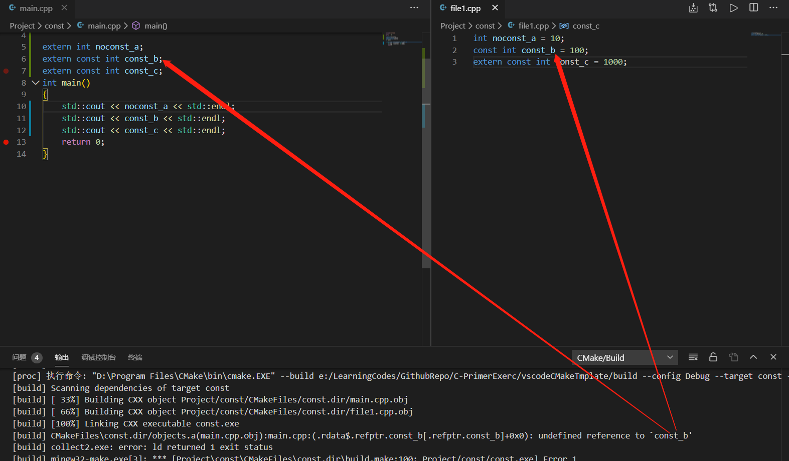
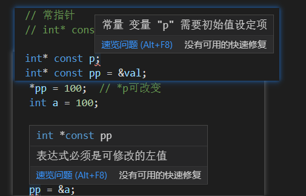
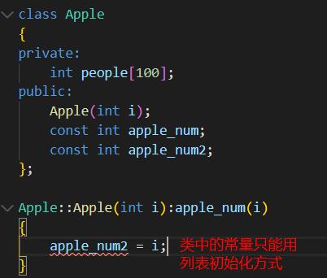
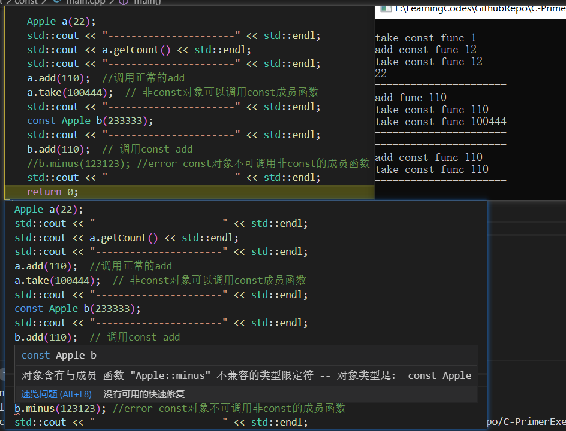
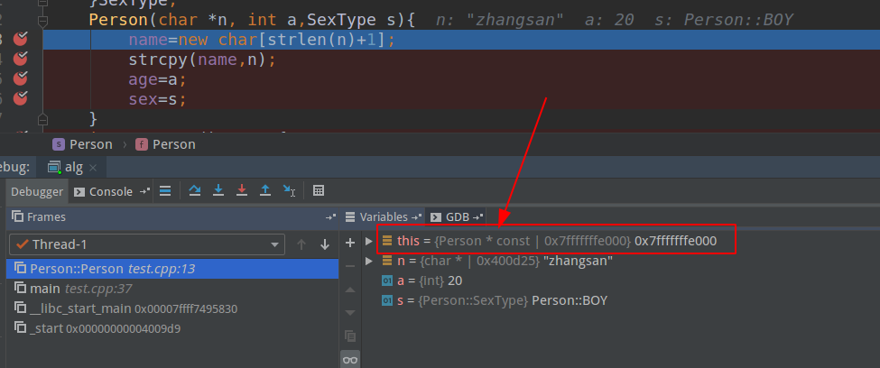
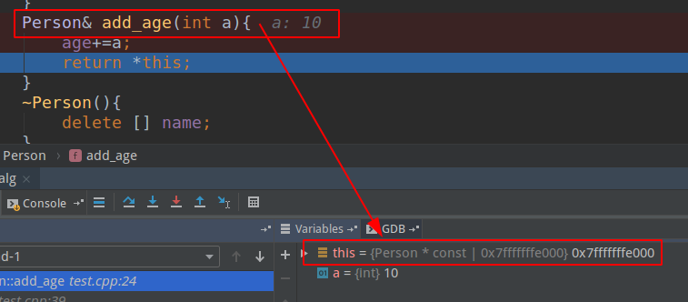

# 基础进阶

# const

## 作用

const为类型说明符，可以用来

* 定义常量；  const int a=10;  

  * 常量表达式：值不会改变 并且在<u>编译过程就能得到计算结果</u>的表达式。字面量（不能改变的值）属于常量表达式，用常量表达式初始化的const对象也是常量表达式。

* 类型检查； 

  ```c++
  注意区分 const常量和#define。
  const常量具有类型安全检查功能，#define仅仅是字符串替换
  const 定义的变量只有类型为整数或枚举，且以常量表达式初始化时才能作为常量表达式。
  其他情况下它只是一个 const 限定的变量，不要将其与常量混淆。
  ```

* 防止修改，起到变量保护的作用；

* 节省空间，避免不必要的内存分配。 

  * const定义常量从汇编的角度来看，只是给出了对应的内存地址，而不是像#define一样给出的是立即数，所以，const定义的常量在程序运行过程中只有一份拷贝，而#define定义的常量在内存中有若干个拷贝

## const对象默认文件为局部变量

非const对象变量默认为<font color=red>extern</font>。extern指定的变量，可以跨文件访问。要使const变量能够在其他文件中访问，必须在文件中显式地指定它为extern。



从上述代码可以分析出：

* 未被const修饰的变量不需要extern显式声明。
* 而const常量需要显式声明extern，并且需要做初始化！因为常量在定义后就不能被修改，所以定义时必须初始化。

## 指针与const

```c++
const char * a; //指向const对象的指针或者说指向常量的指针。
char const * a; //同上
char * const a; //指向类型对象的const指针。或者说常指针、const指针。
const char * const a; //指向const对象的const指针。
```

* **指向常量的指针--const char * a**

  ```c++
  const int *ptr;
  *ptr = 10; //error
  ```

  const修饰的是 *ptr， 也即指针ptr指向常量，因此不能修改所指对象的值。

* **非const对象的地址可以赋给指向const对象的指针（指向常量的指针）**

  ```c++
  const int* ptr;
  int val = 3;
  ptr = &val;  //ok
// *ptr =  10; // error
  ```
  
  <font color=red>不能通过ptr指针来修改val的值，即使它指向的是非const对象!</font>

* 常指针

  ```
  int* const p =&a;
  // const 修饰的是指针p，因此，*p可以改变，但是p不能改，即指向某一对象的指针不能改。
  ```

  <font color=red>const指针必须进行初始化，且const指针的值不能修改。</font>

  

### 函数中使用const

1 函数返回值用const修饰，本身无意义

2 const int* f()  指针指向的内容不可改变

3 int* const 指针本身不可变

4 const修饰函数参数（形参）

* ```c++
  void func(const int var)
  void func(int* const pvar) // 常指针
  ```

  上面两种形式本身无意义：首先var本身就是形参，会赋值一份，本身就不会被改变 所以不要加const 修饰。

  pvar为指针，作为形参传入，在函数内也不会被改变。

* <font color=red>参数指针所指内容为常量不可变</font>

  ```c++
  void StringCopy(char *dst, const char *src);
  ```

  其中src 是输入参数，dst 是输出参数。给src加上const修饰后，如果函数体内的语句试图改动src的内容，编译器将指出错误。这就是加了const的作用之一。

* <font color=red>参数为引用，为了增加效率同时防止修改。</font> 

  ```c++
  void func(const A &a)
  ```

  对于非内部类型来讲，如果使用值传递，效率低（拷贝/赋值等操作），为了提高效率，使用引用来传递参数。但是引用传递”有可能改变参数a，这是我们不期望的。解决这个问题很容易，加const修饰即可。

  <font color=red >对于非内部数据类型的输入参数，应该将“值传递”的方式改为“const 引用传递”, 对于内部数据类型的输入参数，不要将“值传递”的方式改为“const 引用传递”。</font>

### 类中使用const

在一个类中，任何不会修改数据成员的函数都应该声明为const类型。使用const关键字进行说明的成员函数，称为<font color=red>常成员函数</font>>。只有常成员函数才有资格操作常量或常对象，没有使用const关键字声明的成员函数不能用来操作常对象。	

* ***对于类中的const成员变量必须通过初始化列表进行初始化。***



* const对象只能访问const成员函数, 而非const对象可以访问任意的成员函数,包括const成员函数.

  ```c++
  class Apple
  {
  private:
      /* data */
      int people[100];
  public:
      Apple(int i);
  
      const int apple_num; // const成员变量
      void take(int num) const;  // 常成员函数
      int add(int num); // 正常函数
      int add(int num) const; // 常成员函数，
      int getCount() const; //常成员函数
      int minus(int num);
  };
  
  Apple::Apple(int i):apple_num(i)
  {
  
  }
  
  void Apple::take(int num) const
  {
      std::cout <<"take const func "<< num << std::endl; 
  }
  int Apple::add(int num)
  {
      std::cout <<"add func " << num << std::endl; 
      take(num);
      return 0;
  }
  int Apple::add(int num) const
  {
      std::cout <<"add const func " << num << std::endl; 
      take(num);
      return 0;
  }
  int Apple::getCount() const
  {
      take(1);
      add(12); 
      return apple_num;
  }
  
  int Apple::minus(int num)
  {
      std::cout <<"minus func " << num << std::endl; 
      take(num);
      return 0;
  }
  ```

  

  由上面结果看到：

  1 const对象默认调用const成员函数。

  2 const对象只能访问const成员函数, 而非const对象可以访问任意的成员函数,包括const成员函数.

* const常量的另外初始化方式

  * 在外面初始化 

    const int Apple::apple_number=10;

  * c++11，直接可以在定义处初始化

    const int apple_number=10;

# static

static与不同的类型使用，具有不同的意义：

* 静态变量：修饰函数中的变量，类中的变量
* 静态类的成员：修饰类对象和类中的函数。

## 静态变量

### 函数中的变量

当一个变量声明为static时，该变量的生命周期位于整个程序周期内，静态变量只分配一次内存，前一次调用中的变量值通过下一次函数调用传递。

```c++
#include <iostream>

void demo()
{
    static int count = 0;
    std::cout << count << std::endl;
    count++;
}
int main()
{

    for (int i = 0; i < 5; i++)
    {
        /* code */
        demo();
    }
    
    return 0;
}
// 输出
0
1
2
3
4
```

由上面代码可以看出：对于函数中的static变量，它的值可以通过函数调用传递。共享。

### 类中的静态变量

static的变量仅被初始化一次，因为再单独的全局内存的静态内存区域分配了空间，因此**类中的静态变量由对象共享**。 不同的对像不能由相同的静态变量的多个副本，因此：**静态变量不能使用构造函数，需要在类外初始化**

```c++
class Apple
{
public:
    static int i;
    Apple()
    {

    };
};
int Apple::i =10;
int main()
{
    //// 2
    Apple obj1, obj2;
    obj1.i = 1;
    obj2.i = 3;
    std::cout << obj1.i << " " << obj2.i << std::endl;
    return 0;
}
```

如果注释掉：int Apple::i =10; 编译会失败：undefined reference to `Apple::i'

如果有初始化，则输出 3 3

<font color=red>类中的静态变量应由用户使用类外的类名和范围解析运算符显式初始化</font>

## 静态类成员

### 类对象为静态

对象也在声明为static时具有范围，直到程序的生命周期。

```c++
class Apple2
{
public:
    int i;
    Apple2()
    {
        i = 0;
        std::cout << "Constructor" << std::endl;
    }
    ~Apple2()
    {
        std::cout << "Destructor" << std::endl;
    }
};

int main()
{
   //// 3 
    { 
        Apple2 obj; 
    } 
    std::cout << "End of main\n"; 
    std::cout << "-------------------\n"; 
    {
        static Apple2 obj1;  
    }
    std::cout << "End of main2\n";
    return 0;
}

/*
输出：
Constructor
Destructor
End of main
-------------------
Constructor
End of main2
Destructor
*/
```

由上面代码可以看出：

<font color=red>如果对象为非static，其对象生命周期仅在声明它的{}范围内，如果是static对象，其生命周期在整个程序内。</font>

### 类中的静态成员函数

类中的静态成员函数也不依赖于类的对象，建议使用：**类名和范围解析运算符调用类的静态成员函数.**

```c++
#include<iostream> 
using namespace std; 

class Apple 
{ 
    public: 
        // static member function 
        static void printMsg() 
        {
            cout<<"Welcome to Apple!"; 
        }
}; 

// main function 
int main() 
{ 
    // invoking a static member function 
    Apple::printMsg(); 
} 
```

# this

c++类中的this指针作用：

* 一个对象的this指针并不是对象的一部分，因此不会影响到sizeof的结果
* this指针声明周期是在类内部，当类的非静态成员函数访问类的非静态成员变量时，编译器会自动将对象本身作为一个隐含参数this传递给函数。
* 类的非静态成员函数若要返回当前对象，直接return *this；
* 赋值时，如果变量名相同：this->n = n;  

## **this会被编译器解析成什么？**

```c++
#include<iostream>
#include<cstring>
#include<stdlib.h>

class Person
{
private:
    /* data */
    int age;
    char* name;
public:
    Person(char* n, int a)
    {
        name = new char[strlen(n)+1];
        strcpy(name, n);
        age = a;
    }
    ~Person()
    {
     delete[] name;   
    }
    int get_age() const{
        return this->age;
    }
    Person& fuc()
    {
        return *this;
    }
};


int main()
{

    Person p("xxx", 10);
    std::cout << p.get_age() << std::endl;
    Person pp = p.fuc();
    return 0;
}
```

在VS下加断点：





<font size=6 color=red>结论：编译器将this 转为：A* const （常指针）</font>

# inline

