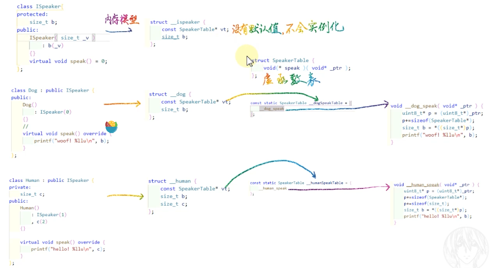

# 虚函数、虚表、多态以及多重继承

## 了解多态

虚基类 （虚函数或者纯虚函数），子类继承基类后，实现相应的纯虚函数。

基类指针指向子类对象。

```c++
#include <cstdio>
#include <cstdint>
#include <cstdlib>

class ISpeaker{
protected:
	size_t b;
public:
	ISpeaker( size_t _v )
		: b(_v) 
	{}
	virtual void speak() = 0;
};

class Dog : public ISpeaker {
public:
	Dog()
		: ISpeaker(0)
	{}
	//
	virtual void speak() override {
		printf("woof! %llu\n", b);
	}
};

class Human : public ISpeaker {
private:
	size_t c;
public:
	Human()
		: ISpeaker(1)
		, c(2)
	{}

	virtual void speak() override {
		printf("hello! %llu\n", c);
	}
};

int main( int argc, char** _argv ) {
	Human* pHuman = new Human();
	Dog* pDog = new Dog();
	//
	ISpeaker* speaker1 = (ISpeaker*)pHuman;  //  都强转为基类指针。
	ISpeaker* speaker2 = (ISpeaker*)pDog;
	
    // 尽管调用方式相同，也会由不同的行为输出。 这里就涉及了多态：动态绑定 
	speaker2->speak(); 
	speaker1->speak();
	//
	return 0;
}
```

## 虚函表

一个类实现了虚函数，编译器会为其生成虚函数表：

  

* 对于基类： 对应的内存模型为，包含一个虚函数表指针，以及一个成员变量b，由于基类为纯虚基类，因此不会被实例化，也就没有虚函数表：

```c
struct __ispeaker {
    const SpeakerTable* vt;
    size_t b;
};
```

* 对于子类Dog，内存模型为：

  ```c
  struct __dog { //内存模型 
      const SpeakerTable* vt;  // 虚函数表指针，
      size_t b; //基类的成员变量。
  };
  ```

  子类实现了虚函数，因此就会产生一个虚函数表：

  ```C
  struct SpeakerTable {  // 虚函数表的形式，为一个： 函数指针
      void(* speak )( void* _ptr );
  };
  
  const static SpeakerTable __dogSpeakTable = {
      __dog_speak // 
  };
  
   // 虚函数表中对应的spake函数的具体实现
  void __dog_speak( void* _ptr ) {
      uint8_t* p = (uint8_t*)_ptr; // 
      p+=sizeof(SpeakerTable*); // 先跳过虚函数表指针的内存区域
      size_t b = *((size_t*)p); // 然后拿到了b的值
      printf("woof! %llu\n", b); // 输出。
  }
  ```

  而在调用时：

```c
Dog* pDog = new Dog();
// 实际上调用的是：
//__dog* dog = (__dog*)malloc(sizeof(__dog));
//dog->vt = &__dogSpeakTable; // 虚函数表指针指向 dog的虚函数表
//dog->b = 0;

ISpeaker* speaker1 = (ISpeaker*)pDog;
// 实际上： __ispeaker* speaker1 = (__ispeaker*)dog;

speaker1->speak(); 
// 实际上：speaker1->vt->speak(speaker1); // 调用的是dog的虚函数表中的函数

```


## 引入多态继承后可能会出现的问题

```c++
#include <cstdio>
#include <cstdint>
#include <cstdlib>

class IRunner {
private:
	size_t a;
public:
	IRunner()
		: a(0){
	}
	virtual void run() = 0;
};

class ISpeaker{
protected:
	size_t b;
public:
	ISpeaker( size_t _v )
		: b(_v) 
	{}
	virtual void speak() = 0;
};

class Dog : public ISpeaker {
public:
	Dog()
		: ISpeaker(1)
	{}
	//
	virtual void speak() override {
		printf("woof! %llu\n", b);
	}
};

class RunnerDog : public IRunner, public Dog {
public:
	RunnerDog()
	{}

	virtual void run() override {
		printf("run with 4 legs\n");
	}
};
```

* 调用

  ```c++
  RunnerDog* pDog = new RunnerDog();
  pDog->speak();  // RunnerDog类中没有speak函数，实际上调用的是Dog类中的函数
  ```

  分析：

  RunnerDog的内存模型如下， 具有两个虚函数表指针，pDog如何跨越16个字节后，去拿到真正的speak函数呢？：

  ```c
  struct __runner_dog {
  	const RunnerTable* vt1; // 64位机器上 8字节
  	size_t a; // 8字节
  	const SpeakerTable* vt2; //8字节
  	size_t b;
  };
  ```

实际上调用时：

```c++
ISpeaker* speaker1 = static_cast<ISpeaker*>(pDog);
speaker1->speak();
```

dog先转化位为ISpeaker，然后调用。此时使用了static_cast，而不是强转，如果时强转的化，后面的16个字节就会丢失掉。

上述的转化对应到C下的原型实际上为：

```c
//构造dog
__dog* dog = (__dog*)malloc(sizeof(__dog));
dog->vt = &__dogSpeakTable;
dog->b = 0;

//构造runnerdog
__runner_dog* runnerDog = (__runner_dog*)malloc(sizeof(__runner_dog));
runnerDog->vt1 = &__dogRunnerTable;
runnerDog->a = 0;
runnerDog->vt2 = &__dogSpeakTable;
runnerDog->b = 1;

// 指向dog基类虚函数表指针的指针
SpeakerTable** speaker = nullptr;
{
    uint8_t* ptr = (uint8_t*)runnerDog;
    union {
        const SpeakerTable* __runner_dog::* memOffset;
        size_t offset;
    } u;
    u.memOffset = &__runner_dog::vt2; // 先拿到第二个虚函数表指针的偏移  16个字节
    ptr += u.offset;
    speaker = (SpeakerTable**)ptr; // 然后输出。
}

(*speaker)->speak(speaker);  //调用speak函数。此时speakerhi指向了dog的虚函数表
// 等价于
runnerDog->vt2->speak(speaker);
```

* 反之： 如果想将父类的指针转化为子类的指针时：

  ```c++
  //若直接如下转，报错
  // runnerDog成了野指针
  // 
  Dog* simpleDog = new Dog();
  RunnerDog* runnerDog = static_cast<RunnerDog*>(simpleDog);
  runnerDog->run(); // error
  ```

  实际上应该用如下的方式转化：

  ```c++
  ISpeaker* speaker = static_cast<ISpeaker*>( simpleDog );
  
  // RunnerDog* runnerDog = static_cast<RunnerDog*>(speaker); //如果使用static_cast来转，runnerDog会编程野指针，报错，因此c++提出了dynamic_cast
  
  RunnerDog* runnerDog = dynamic_cast<RunnerDog*>(speaker);
  // dynamic_cast可以判断runnerDog对象是不是speaker对象，如果是就可以转，
  //如果不是返回NULL（有类型检查，比较安全。）
  // dynamic_cast需要查询RTTI 信息。因此效率低 
  if(runnerDog){
  	runnerDog->run();
  }
  ```

总结：

* 子类 向 基类 转化时：使用  static_cast<>() 
* 基类 向 子类 转化时：使用  dynamic_cast<>()

* dynamic_cast在将父类cast到子类时，父类必须要有虚函数，否则编译器会报错。**static_cast**则没有这个限制。

* dynamic_cast主要用于类层次间的上行转换和下行转换，还可以用于类之间的交叉转换。
   在类层次间进行**上行转换（把派生类的指针或引用转换成基类表示））**时，dynamic_cast和static_cast的效果是一样的；
   在进行**下行转换（（把基类指针或引用转换成派生类表示））**时，dynamic_cast具有类型检查的功能，比static_cast更安全。